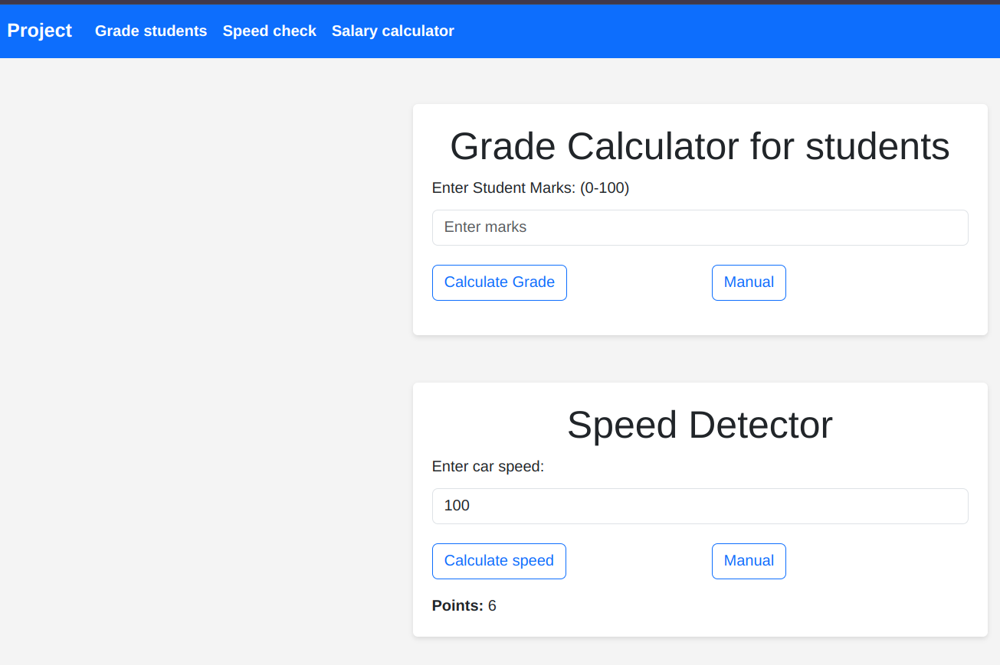

**Access the live website here => [moringa_week1](https://jwathika.github.io/code_challenge_wk_1/)**

# Challenge 1: Student Grade Generator

This program prompts the user to input student marks and outputs the corresponding grade based on the following criteria:

A > 79
B - 60 to 79
C - 50 to 59
D - 40 to 49
E - less than 40

# Challenge 2: Speed Detector

Write a program that takes as input the speed of a car e.g 80. If the speed is less than 70, it should print “Ok”. Otherwise, for every 5 km/s above the speed limit (70), it should give the driver one demerit point and print the total number of demerit points.

# Challenge 3: Net Salary Calculator

Write a program whose major task is to calculate an individual’s Net Salary by getting the inputs of basic salary and benefits. Calculate the payee (i.e. Tax), NHIFDeductions, NSSFDeductions, gross salary, and net salary.

Used KRA,NHIF and NSSF links for authenticity.

**How to Run the Program:**

0. OPTIONAL => Fork the repository (only if you need to edit it!)

1. Clone this repository to your local machine.
   ```bash
   git clone https://github.com/jwathika/code_challenge_wk_1.git
   ```
2. Open a terminal and navigate to the directory where the program is saved.
   ```bash
   cd code_challenge_wk_1
   ```
3. Run the program by executing the command
   ```bash
   chrome index.html
   ```
4. It shall now open on your default browser e.g Chrome, Safari then now input the figures so as to calculate.

**Error handling:**

The figures are realistic i.e not less than 0.

For grades it doesn't exceed 100 marks.

For speed it doesn't exceed 360km/hr.

All inputs are in Integer format else if in float, converts to nearest whole number.

All outputs and errors are logged on the console.

**Sample**

